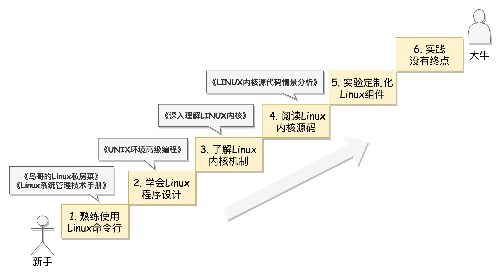

# Linux 操作系统

## Linux 的练级攻略

1. 熟练使用 Linux 命令行，切换为”命令行+文件“ 使用模式
2. 通过系统调用或者 glibc, 学会自己进行程序设计
3. 了解 linux 内核机制，知道基本原理和流程，反复研习重点突破，知识点相互对照
4. 阅读 Linux 内核代码，聚焦核心逻辑和场景
5. 实践定制化 Linux 组件，成为内核开发工程师
6. 面向真实开发场景，实践没有终点

### 阶段性参考书籍

- 《鸟哥的linux私房菜》： 学习命令
- 《Linux系统管理技术手册》 ： linux 运维手边必备
- 《UNIX 环境高级编程》 ：linux程序设计，有代码、有介绍、有原理
- 《深入理解 Linux 内核》: 言简意赅地讲述了内核机制，版本较老
- 《LINUX 内核源代码情景分析》优点是结合场景进行分析，看得见、摸得着，非常直观，唯一的缺点是版本老

