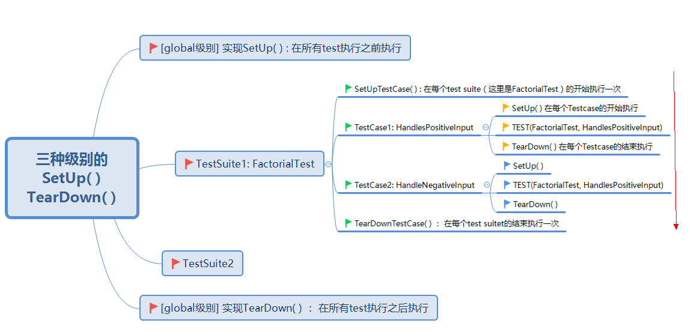

# 测试框架 google test 的使用

## 简介

google test 是google 开源的 针对C++的单元测试框架，简称 gtest

官网：[googletest and googlemock](https://github.com/google/googletest) 

解读： [玩转Google开源C++单元测试框架Google Test系列](https://www.cnblogs.com/coderzh/archive/2009/04/06/1426755.html)


## 基本示例

1. 在CMakeLists.txt中加入google test.

2. 引入头文件： `#include <gtest/gtest.h>`

3. 使用`TEST()`宏来定义命名测试函数，该函数没有返回值。

   ```c++
   // 注意这里一个test suite（FactorialTest）包含了三个test case
    
   // Tests factorial of 0.
   TEST(FactorialTest, HandlesZeroInput) {} 
    
   // Tests factorial of positive numbers.
   TEST(FactorialTest, HandlesPositiveInput) {}  
    
   // Tests factorial of negative numbers.
   TEST(FactorialTest, HandlesNegativeInput) {}
   ```

4. 使用 `EXPECT_*` 和 `ASSER_*`系列[断言](https://github.com/google/googletest/blob/master/googletest/docs/Primer.md#assertions)设置检查点：返回值检查，布尔值检查、字符串对比、异常检查、类型检查、浮点型检查。当断言失败的时候，定位问题变得容易，一个接一个修复

   - ASSERT_* 系列的断言，当检查点失败时，退出当前函数
   - EXPECT_* 系列的断言，当检查点失败时，继续往下执行
   - [断言速查]( <http://www.cnblogs.com/coderzh/archive/2009/04/06/1430364.html)

5. 在`Main`函数中初始化环境，再使用`RUN_ALL_TEST()`运行测试案例

   ```c++
   int main(int argc, char* argv[]) {
       testing::InitGoogleTest(&argc, argv);
       return RUN_ALL_TESTS();
       
   	//如果使用 gtest 的同时使用 gflag, 由于 gflag 和 gtest 都接收命令行参数输入，需要先由 gtest 接收，再由 gflag 接收，否则会导致 gtest 参数传入 gflag 模块后报错。
   
       // 正确顺序如下:
   //    testing::InitGoogleTest(&argc, argv);
   //    google::ParseCommandLineFlags(&argc, &argv, true);
   
   }
   
   ```

6. 注意点： `ASSERT_*`系列断言只能用于空返回的函数，原因是Google Test没有使用异常。如果在非空函数中使用`ASSERT_*`断言，会出现编译报错`error: void value not ignored as it ought to be` 。如果要在非空函数中使用，一个方法是使用out parameter, 如将 T2 Foo(T1 x) 改写为 void Foo(T1 x, T2* result)。


## 测试复用

创建对象、分配资源，释放资源是测试代码经常要做的两件事情。google test在这方面提供了一些支持：继承特定的类，并按需实现方法。

共有三种级别:

1. global 级别——继承 testing::Environment 类，实现 SetUp() 和 TearDown()
2. test suite 级别——继承 testing::Test 类，实现 SetUpTestCase() 和 TearDownTestCase(), 使用`TEST_F` 而非`TEST`
3. test case 级别——继承 testing::Test 类，实现 SetUp() 和 TearDown(), 使用`TEST_F` 而非`TEST`

举例：程序需连接数据库，并不需要每个test case都连接数据库，这个时候将这个操作适合放到test suite级别或global级别。




## 灵活的参数化测试

由来：当有一组测试数据用于同个测试，为避免多次调用同个测试函数会出现代码重复冗长的情况，因而有了这个解决方案。

继承`::testing::TestWithParam<T>` ，`T`是测试数据的参数类型

使用`TEST_P`宏，在`TEST_P`宏中，使用`GetParam()`获取当前参数的具体值

使用 `INSTANTIATE_TEST_CASE_P` 告诉gtest我们要测试的参数范围 （需求复杂时，其表示也可以很灵活简便）

在这个类中，如果有需要，也可以实现的SetUp()和TearDown().

[示例](<http://www.cnblogs.com/coderzh/archive/2009/04/08/1431297.html>)

