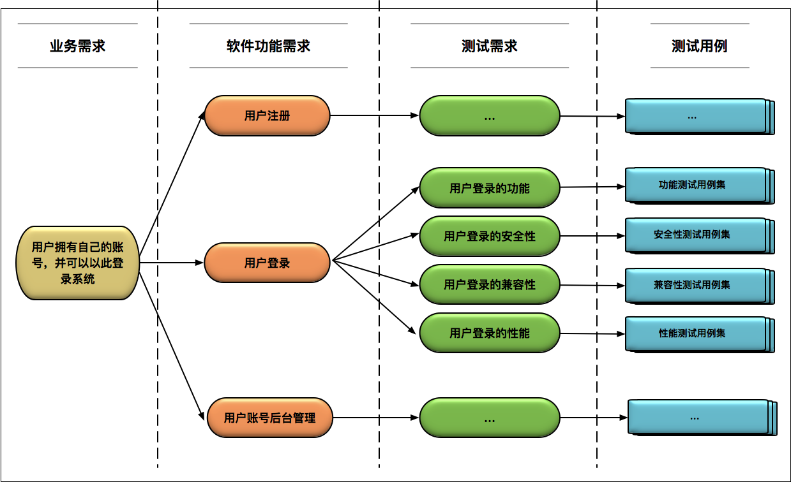

# 测试用例

## 测试用例的设计

测试用例的设计需要考虑：

- 明确的功能性需求 （软件本身需要实现的功能）
  - 使用等价类划分和边界值分析方法进行设计
  - 在以上基础上，扩充用例
- 非功能性需求 （软件质量的关键因素）
  - 安全性
  - 性能
  - 兼容性

举个例子：用户登录功能：在网页上输入用户名和密码，然后点击确认按钮，验证下是否登录成功。

[登录功能通用测试用例设计](https://blog.51cto.com/andyboge/1950371) 或 [登录功能通用测试用例设计](https://www.cnblogs.com/jpr-ok/p/6418492.html)

Base Practice：在工程实践中，由于时间和经济成本，很难穷尽所有可能的组合，一般根据具体风险来决定测试范围和优先级，在质量和成本之间寻找平衡点。

## 好的测试用例是怎样的？

> 好的测试用例是一个完备的集合，能够覆盖所有等价类以及各种边界值。

- 整体完备性：是有效测试用例组成的集合，能够完全覆盖测试需求。
- 等价类划分的准确性：对于每个等价类都能保证只要其中一个输入测试通过，其他输入也一定测试通过。
- 等价类集合的完备性：需要保证所有可能的边界值和边界条件都已经正确识别。

### 三种最常用的测试用例设计方法

> 综合运用以下三种方法，可能满足绝大多数软件测试用例设计的需求。

- 等价类划分法
  - 将所有可能的输入数据划分成若干个子隼，在每个子集中，如果任意一个输入数据对于揭露程序中潜在错误都具有同等效果，那么这样的子集就构成了一个等价类。后续只要从每个等价类中任意选取一个值进行测试，就可以用少量具有代表性的测试输入取得较好的测试覆盖结果。
- 边界值分析法
  - 选取输入、输出的边界值进行测试。因为通常大量的软件错误是发生在输入或输出范围的边界上，所以需要对边界值进行重点测试，通常选取正好等于、刚刚大于或刚刚小于边界的值作为测试数据。
- 错误推测法
  - 基于对被测试软件系统设计的理解、过往经验和个人直觉，推测出软件可能存在的缺陷，从而有针对性地设计测试用例的方法。
  - 理念类似于“探索式测试”，在敏捷开发中因投入产出比很高而被广泛使用，缺点是依赖个人能力，难以系统化。
  - Base practice:  为了降低对个人能力的依赖，通常会建立`缺陷知识库`，在测试设计过程中，作为 checklist 使用，在实践中完善这个 checklist。可能是以 wiki 页面的形式或作为数据库用于自动生成测试数据。

## 如何设计出好的测试用例？

1. 从软件功能需求出发，全面地、无遗漏地识别出测试需求
   - 搞清楚每一个`业务需求`所对应的多个`软件功能需求点`，分析出每个软件功能需求点对应的多个`测试需求点`，最后针对每个测试需求点设计`测试用例`。
   - 举例：
   - 需求追踪管理工具，如 ALM、DOORS、JIRA、TestLink
2. 对于识别出的每个测试需求点，综合运用等价类划分、边界值分析和错误推测方法来全面地设计测试用例
3. 用例设计的其他经验
   - 只有深入理解被测软件的架构，才能设计出“有的放矢”的测试用例集，发现系统边界和系统集成上的潜在权限。
     - 测试工程师必须对内部的架构有清楚的认识，比如数据库连接方式，数据库的读写分离，消息中间件Kafka的配置、缓存系统的层级分布、第三方系统的集成等。
   - 必须深入理解被测软件的设计与实现细节，仅根据测试需求点设计用例，往往覆盖不到内部的处理流程、分支处理。应该依据原始需求设计测试用例，而不要以开发代码的实现为依据设计。
   - 引入`需求覆盖率`和`代码覆盖率`来衡量测试执行的完备性，寻找可能的遗漏点。

## 出处

[你真的懂测试吗？从“用户登录”测试谈起](<https://time.geekbang.org/column/article/10030>)

[如何设计一个“好的”测试用例？](<https://time.geekbang.org/column/article/10150>)

