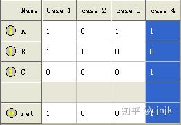
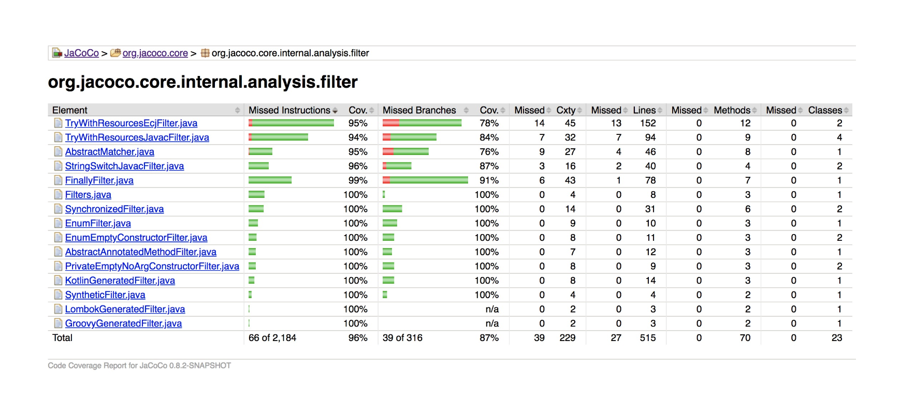
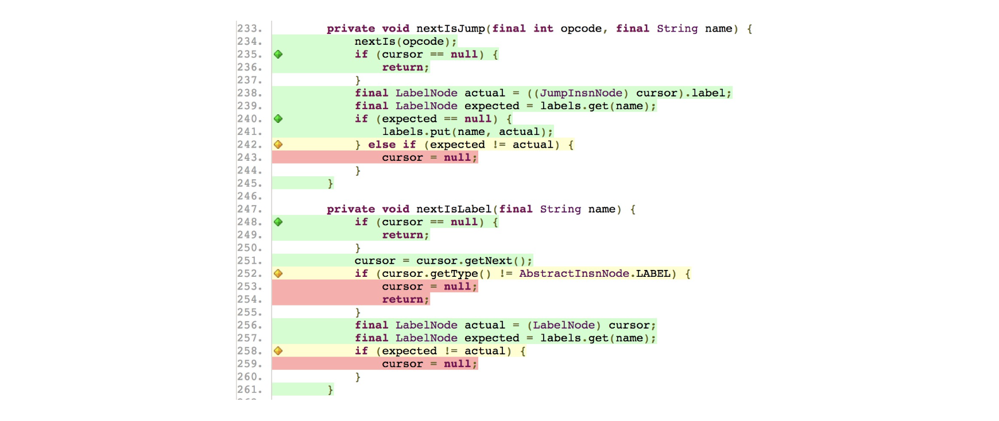

# 测试覆盖率（需求覆盖率和代码覆盖率）

测试覆盖率一般用来衡量测试的充分性和完整性。


## 测试覆盖率分为两大类

- 需求覆盖率

  - 测试对需求的覆盖程度，常见做法是将每一条分解后的软件需求和对应的测试建立一对多的映射关系，最终目标是保证测试可以覆盖每个需求，以保证软件产品的质量
  - 可用需求管理工具（ALM、Doors 和 TestLink）来建立需求和测试的对应关系，以此计算需求覆盖率
  - 互联网项目中很少直接基于需求来衡量测试覆盖率，而是将软件需求转换成测试需求，然后基于测试需求再来设计测试点。
- 代码覆盖率

  - 至少被执行了一次的条目数占整个条目数的百分比
  - 根据条目类型不同，对应着不同的覆盖率：
    - 语句——代码行/语句覆盖率: 指已经被执行到的语句占总可执行语句的百分比
    - 函数——函数覆盖率:
    - 路径——路径覆盖率

人们一般讲的测试覆盖率，指的是代码覆盖率。


## 几种代码覆盖率

> 常用的就 语句覆盖、判定覆盖、条件覆盖

**覆盖度从低到高：**

### 语句覆盖 （Statement Coverage）

- 即代码行覆盖，指已经被执行到的语句占总可执行语句(不包含类似 C++ 的头文件声明、代码注释、空行等)的百分比，也就是设计的测试用例要保证程序中的每一个语句至少被执行一次
- 没有考虑到各种条件和分支，很难发现代码中问题

### 判定覆盖 （Decision Coverage）也叫分支覆盖 Branch Coverage

- 用以度量程序中每一个判定的分支是否都被测试到了，即设计的测试用例要让代码中每个判断的取真分支和取假分支是否各被覆盖至少各一次。比如，对于 if(a>0 && b>0)，就要求覆盖“a>0 && b>0”为 TURE 和 FALSE 各一次
- 缺点：往往一些判定条件都是由多个逻辑条件组合而成的，进行分支判断时相当于对整个组合的最终结果进行判断，这样忽略了每个条件的取值情况，容易遗漏部分测试路径。

### 条件覆盖 （Condition Coverage）

- 指判定中的每个条件的可能取值至少满足一次，度量判定中的每个条件的结果 TRUE 和 FALSE 是否都被测试到了。比如，对于 if(a>0 && b>0)，就要求“a>0”取 TRUE 和 FALSE 各一次，同时要求“b\>0”取 TRUE 和 FALSE 各一次。

- 缺陷：条件覆盖不一定包含判定覆盖。

### 判定条件覆盖

- 测试用例可以使得判断中每个条件所有的可能取值至少执行一次（条件覆盖），同时每个判断本身所有的结果也要至少执行一次（判定覆盖）
- 缺点：并未考虑条件的组合情况

### 条件组合覆盖（Branch Condition Combination Coverage）

- 测试用例应该使得每个判定中的各个条件的各种可能组合都至少出现一次。显然，满足条件组合覆盖的测试用例一定是满足判定覆盖、条件覆盖和判定条件覆盖的。

- 缺点：测试用例数量也很多

### 路径覆盖

- 测试用例可以覆盖程序中所有可能的执行路径。

- 缺点：测试用例数量巨大。


## 有点难懂的 MC/DC 覆盖率——修订的条件/判定覆盖

> 高标准的代码覆盖率指标，一般在对安全性要求高的领域会有要求，比如航空航天、汽车。

MC/DC （Modified Condition/Decision Coverage）覆盖率：

MC/DC定义如下：

- Condition —— a Boolean expression containing no Boolean operators 条件表示不含有布尔操作符号的布尔表达式；
- Decision —— a Boolean expression composed of conditions and zero or more Boolean operators：判定表示由条件和零或者很多布尔操作符号所组成的一个布尔表达式；
- Modified Condition/Decision Coverage —— every point of entry and exit in the program has been invoked at least once，every condition in the program has taken all possible outcomes at least once，and each condition in a decision has been shown to independently affect a decision S outcome by varying just that condition while holding fixed all other possible conditions.  修正条件判定覆盖要求在一个程序中每一种输入输出至少得出现一次，在程序中的每一个条件必须产生所有可能的输出结果至少一次，并且**每一个判定中的每一个条件必须能够独立影响一个判定的输出**，即在其他条件不变的前提下仅改变这个条件的值，而使判定结果改变。

解读：MC/DC 已经满足了前面讲的几种覆盖，在此基础上，对于每个条件C，要求存在符合以下条件的两次计算：

- 条件C 所在判断内的所有条件，除条件C 以外，其他条件的取值完全相同；

- 条件C的取值相反；

- 判定的计算结果相反；

MC/DC是条件组合覆盖的子集。条件组合覆盖要求覆盖判定中所有条件取值的所有可能组合，需要大量的测试用例，实用性较差。MC/DC具有条件组合覆盖的优势，同时大幅减少用例数。满足MC/DC的用例数下界为条件数+1，上界为条件数的两倍，例如，判定中有三个条件，条件组合覆盖需要8个用例，而MC/DC需要的用例数为4至6个。如果判定中条件很多，用例数的差别将非常大，例如，判定中有10个条件，条件组合覆盖需要1024个用例，而MC/DC只需要11至20个用例。

下面是MC/DC的示例：

```C
int func(BOOL A, BOOL B, BOOL C)
{
if(A && (B || C))
return 1;
return 0;
}
```

用例：



对于条件A，用例1和用例2，A取值相反，B和C相同，判定结果分别为1和0；

对于条件B，用例1和用例3，B取值相反，A和C相同，判定结果分别为1和0；

对于条件C，用例3和用例4，C取值相反，A和B相同，判定结果分别为0和1。

参考：

<https://baike.baidu.com/item/MC/DC/4520029?noadapt=1>

总结一句:每个条件对结果都独立起作用

比如A对结果起作用的话, B 必须为 false, C必须为 true -- 1 0 1 和 0 0 1, 这样结果就独立受A的值影响.

同理如果B对结果独立起作用的话,A必须为false, C必须为 true, 两种情况B为true,false各一. 即为 0 1 1 和 0 0 1

而C独立对结果起作用的话就是让(A or B) 为 true, 为了减少case, 上面的case 已经含有这样的case了,我们就取A为false,B为true, 这样c独体起作用的case为: 0 1 1 和 0 1 0

可以看出每个条件各走了一次true和false, 这样三个变量条件就会有六个case, 我们看出其中里面还有两个是重复的,


与条件判定覆盖的差别：

<https://www.cnblogs.com/yangxia-test/p/3767842.html>


## 代码覆盖率有什么用？

- 统计代码覆盖率的根本目的：
  - **是找出潜在的遗漏测试用例，并有针对性的进行补充，**
  - **同时还可以识别出代码中那些由于需求变更等原因造成的不可达的废弃代码**。

代码覆盖率越高说明测试用例的设计是充分完备的，但**随着代码覆盖率提高所需的测试成本会越大越大**，因为后期需要大量的桩代码、Mock代码和全局变量的配合来控制执行路径。

在软件生命周期的不同阶段中，**一般仅在单元测试阶段对代码覆盖率有较高的要求**，因为其他阶段要提高覆盖率代价很大，有时根本做不到，而单元测试阶段的话，可以使用桩代码来提高覆盖率，技术上可行性高。


## 代码覆盖率的局限性

**代码覆盖率的计算是基于现有代码的，并不能发现那些 ”未考虑某些输入” 以及 ”未处理某些情况” 形成的缺陷。**代码覆盖率反映的仅仅是已有代码的哪些逻辑被执行过了，哪些逻辑还没有被执行过。对于那些压根还没有代码实现的部分，基于代码覆盖率的统计指标就无能为力了。
**所以，即使MC/DC代码覆盖率达到了100%，也不能说明软件质量达到了万无一失。**

高的代码覆盖率不一定能保证软件的质量，但是低的代码覆盖率一定不能保证软件的质量。


## 代码覆盖率工具

C++: Kcov、VectorCast

Java: JaCoCo

JavaScript: JSCoverage、Istanbul

### 报告举例

每个 Java 代码文件的行覆盖率以及分支覆盖率统计，并给出了每个 Java 代码文件的行数、方法数和类数等具体信息。



每个 Java 文件内部详细的代码覆盖率情况，图中绿色的行表示已经被覆盖，红色的行表示尚未被覆盖，黄色的行表示部分覆盖。左侧绿色菱形块表示该分支已经被完全覆盖、黄色菱形块表示该分支仅被部分覆盖。



### 代码覆盖率工具的实现原理

实现代码覆盖率的统计，最基本的方法就是注入（Instrumentation）。简单地说，注入就是在被测代码中自动插入用于覆盖率统计的探针（Probe）代码，并保证插入的探针代码不会给原代码带来任何影响。

